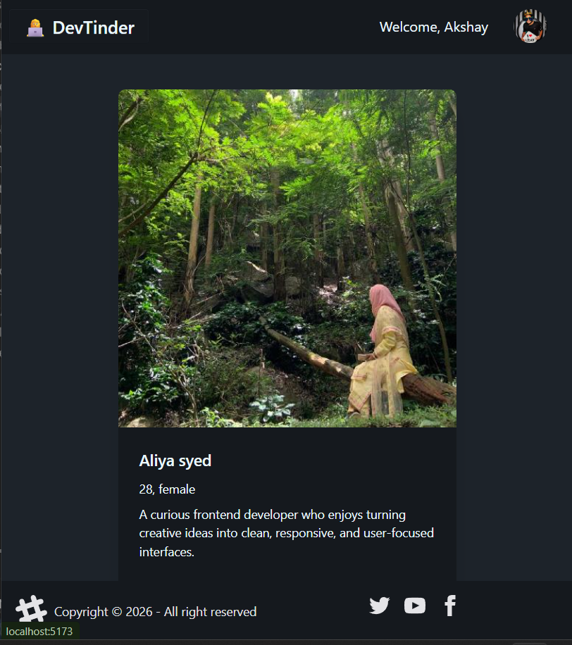

# DevTinder

> A responsive developer networking app where users can discover other developers, send connection requests, and manage their profile.

---

## Overview

DevTinder is a React-based social connection app built for developers who want a simple way to find and connect with other people in the tech community. Users can sign up, log in, view a personalized feed of developer profiles, show interest or ignore profiles, manage incoming connection requests, view accepted connections, and edit their own profile. The app is fun because it brings a familiar swipe-style discovery experience into a developer-focused networking space.

---

## Features

- User authentication with login and signup
- Protected routes with automatic redirect for unauthenticated users
- Developer feed with user profile cards
- Send interested or ignored requests from the feed
- View all accepted connections
- Accept or reject incoming connection requests
- Edit profile details and save updates
- Redux-powered global state management
- Responsive UI using Tailwind CSS and DaisyUI

---

## Tech Stack

| Technology | Purpose |
|-------------|----------|
| **React** | Building reusable UI components |
| **Vite** | Fast frontend development and build tooling |
| **Tailwind CSS** | Utility-first styling and responsiveness |
| **DaisyUI** | Prebuilt styled UI components |
| **JavaScript (ES6)** | App logic and interactivity |
| **React Router DOM** | Client-side routing and nested routes |
| **Redux Toolkit** | Global state management |
| **React Redux** | Connecting Redux state to React components |
| **Axios** | API requests with credentials |

---

## What We Have Studied

Here are the key JavaScript, React, and frontend concepts practiced while building this project:

- Creating a Vite + React application
- Component-based UI development
- React hooks like `useState`, `useEffect`, `useSelector`, `useDispatch`, and `useNavigate`
- Conditional rendering for login, signup, empty states, and protected views
- Routing with `BrowserRouter`, `Routes`, `Route`, and `Outlet`
- Nested routes and shared layouts
- API integration using Axios
- Handling cookies with `withCredentials: true`
- Redux Toolkit store setup with slices and reducers
- Updating UI after API actions
- Styling responsive layouts with Tailwind CSS and DaisyUI
- Basic authentication flow and route protection

---

## Lessons Learned

> - React hooks should always be called at the top level of a component.
> - API response structure matters when saving data to Redux.
> - Protected routes need both frontend checks and backend authentication.
> - Redux makes shared user, feed, connection, and request data easier to manage.
> - Small UI states like loading, empty lists, and error messages improve the user experience.

---

## Screenshots / Demo

Live Demo: [https://your-demo-link.vercel.app](https://your-demo-link.vercel.app)

---

## Author

Created by [Aliya](https://github.com/aliyasyeddd)

> "Build. Break. Learn. Repeat."

---
